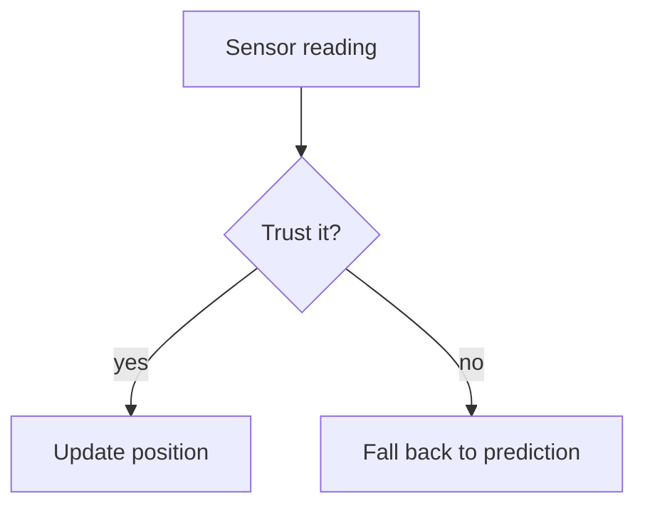

# Interactive Components in Deep Dive MDX

Deep-dive articles can embed interactive React components (canvas
demos, sliders, simulations) directly inside their `.mdx` files.

## Where files live

Each series gets its own `interactive/` folder:

```
src/content/deep-dives/{series-slug}/interactive/MyComponent.tsx
```

## Registering a component

1. Build the component in the series' `interactive/` folder, marked
   `"use client"`. Guard any browser-only work (canvas, pointer events,
   `window`) behind refs/effects so the component still renders safely
   during the server pass.
2. Register it in `src/lib/interactiveComponents.ts`:

```ts
MyComponent: dynamic(() =>
  import("@/content/deep-dives/{series-slug}/interactive/MyComponent")
),
```

3. That registry is merged into the shared MDX components map in
   `src/components/mdx/MDXComponents.tsx`, so it's available to every
   deep-dive article.

## Using it in MDX

```mdx
<MyComponent />
```

## Why no `ssr: false`

`MDXComponents.tsx` is a Server Component, and Next.js only allows the
`ssr: false` option on `dynamic()` inside a Client Component. `dynamic()`
without it still code-splits each component — it just means the
component's initial (unhydrated) render must be safe on the server,
which is why browser-only work belongs inside effects/handlers.

## Diagrams

Use a fenced `mermaid` block anywhere in an insight card or deep-dive
`.mdx` file — no import or registration needed:

````mdx

````

- Append `:::key` to a node to mark it as the one that matters — it gets
  the accent border. Use it sparingly (one node per diagram); every other
  node uses the standard elevated fill and border.
- Write a fenced block, not a JSX tag: MDX treats `{}` as JavaScript,
  which clashes with Mermaid syntax such as `B{Trust it?}`.
- Colours and the label font come from the site's design tokens, so don't
  add `%%{init}%%` theme overrides or `style` / `classDef` colours.
- A diagram that fails to parse shows the error and its source in place;
  the rest of the page still renders. Check every new diagram in the dev
  server.
- Rendered by `src/components/mdx/Mermaid.tsx` via the `pre` override in
  `MDXComponents.tsx`. Mermaid itself is only downloaded on pages that
  contain a diagram.
