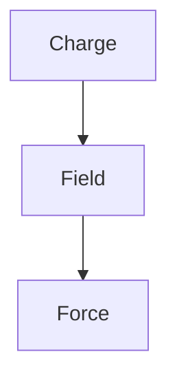

Before the idea of fields, physics had an uncomfortable problem: gravity and electricity seemed to make objects influence one another across empty space.

Faraday's answer was to stop thinking of space as irrelevant emptiness.

A charge creates an electric field throughout the surrounding space. Another charge doesn't somehow reach across the void. **It responds to the field where it is.**

So the chain becomes:

The field turns “action at a distance” into a local interaction.

That idea eventually became one of the foundations of modern physics.